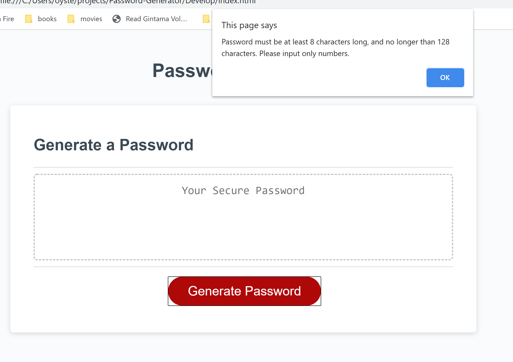
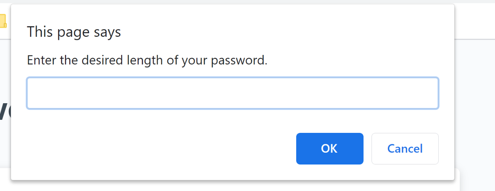
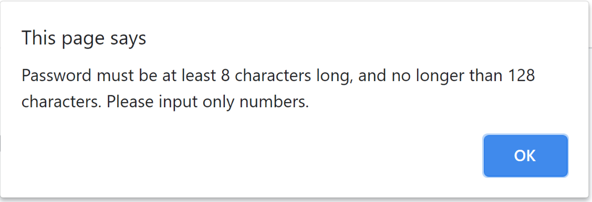
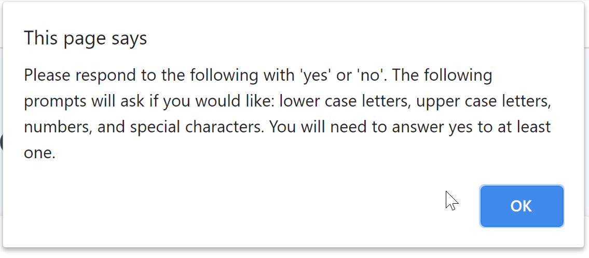
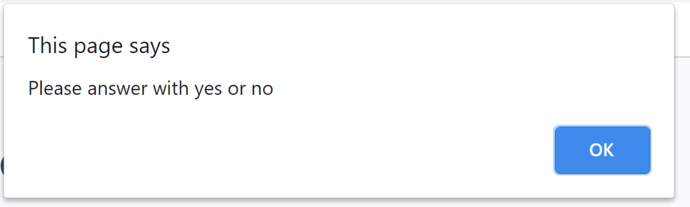

# Password-Generator
# Password generator program with seeding options

Secure passwords are increasingly more useful and more stringent in order to ensure that critical processes and information can be maintained safe. This password generator is equipped with the options and the interface to allow users to pick how stringent of a password they want and randomly generate one using those parameters. 

https://alexjalva.github.io/Password-Generator/

## Installation
 Files can be downloaded at : https://alexjalva.github.io/Password-Generator/

 All files needed are contained within the repository. The main folder needs to include the develop folder and all 3 files. As long as all files are included, and placed in that order, the html should be able to run functions from the script file. 

 ## Usage
 ##How to access the page
Webpage can be loaded based off of html in main repository. 

### How to Navigate the Website

The center generate password button is the main nexus of control. Users will only need to hit the generate password button to get the process started. The process will include a series of alerts and validated prompts that the user will need to enter data into to generate a password. 

First Alert - Users will first be explained what information they will be asked for and how it will affect the generated password.

Password Length Prompt - Users will be instructed on password length rules and will be told to enter a usable length. 

Password Length Validation - Users will be told if they entered an invalid entry or an invalid length. 

#### Password Requirements Entry and Validation

Requirements Prompt with Explanation - Users will be instructed that they are to expect a series of prompts. They will be instructed to enter yes or no as the only valid options and that they must enter yes to at least one of the following requirements. 

Requirements Validation - Users will be reminded that they are to enter yes or no as the only valid options.  

### How to view the content
The content will be viewable on each page, and will resize depending on screen size. See below for examples of page at different screen sizes. 

Password Display - The generated password will be displayed in the center of the page where the generate password text is originally.

## Credits
Original page was created by Alexander Alvarado

## License
MIT License

Copyright (c) 2020 Alexander Alvarado 

Permission is hereby granted, free of charge, to any person obtaining a copy
of this software and associated documentation files (the "Software"), to deal
in the Software without restriction, including without limitation the rights
to use, copy, modify, merge, publish, distribute, sublicense, and/or sell
copies of the Software, and to permit persons to whom the Software is
furnished to do so, subject to the following conditions:

The above copyright notice and this permission notice shall be included in all
copies or substantial portions of the Software.

THE SOFTWARE IS PROVIDED "AS IS", WITHOUT WARRANTY OF ANY KIND, EXPRESS OR
IMPLIED, INCLUDING BUT NOT LIMITED TO THE WARRANTIES OF MERCHANTABILITY,
FITNESS FOR A PARTICULAR PURPOSE AND NONINFRINGEMENT. IN NO EVENT SHALL THE
AUTHORS OR COPYRIGHT HOLDERS BE LIABLE FOR ANY CLAIM, DAMAGES OR OTHER
LIABILITY, WHETHER IN AN ACTION OF CONTRACT, TORT OR OTHERWISE, ARISING FROM,
OUT OF OR IN CONNECTION WITH THE SOFTWARE OR THE USE OR OTHER DEALINGS IN THE
SOFTWARE.
